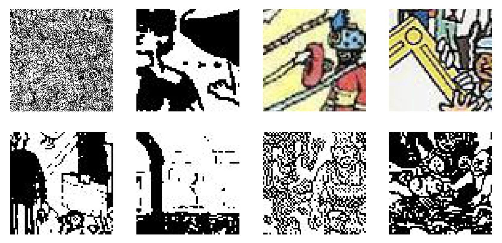
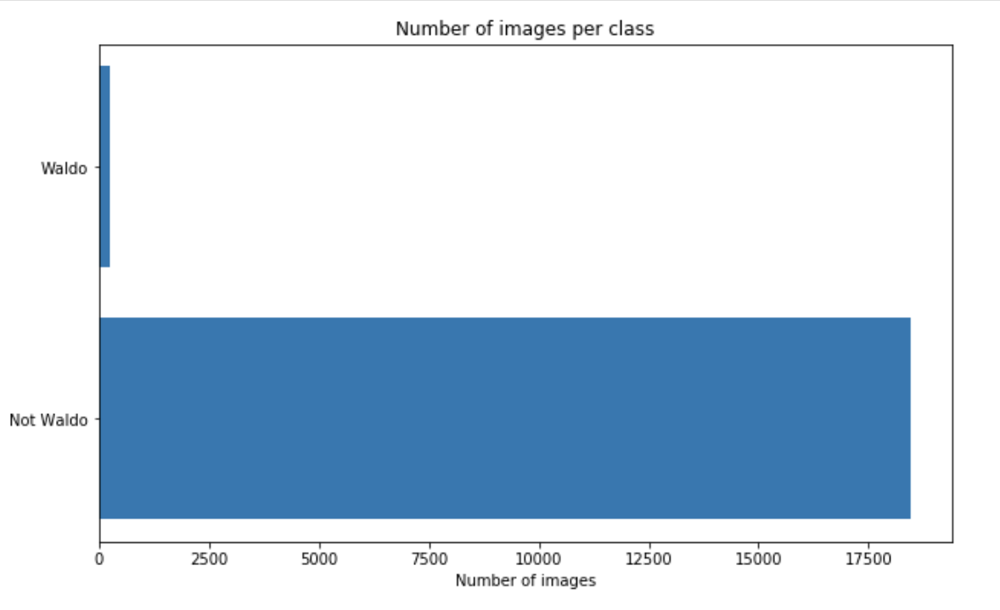

The dataset has been sourced from [Kaggle](https://www.kaggle.com/residentmario/wheres-waldo), there are images of three sizes:
- 256 x 256 pixels (317 images)
- 128 x 128 pixels (1344 images)
- 64 x 64 pixels (5376 images) 

All images are sorted into waldo and notwaldo folders depending on theit size. I used Tensorflow and Keras, in which case it is not important for the images fed into the model to be the same size: they are rescaled to the input size specified in the model. That is why I moved all the images into waldoAll folder to have them in one place before training. 

Here is how the images look:

Some of them have been preprocessed to be grayscale, some are color, some are kept black and white. All in all a great dataset to learn from, but there is one problem: there is a significant class imbalance.

Let's see what Tensorflow can do in this case.

TODO:

- test the model
- change model settings to see how much it can be improved
- add more comments